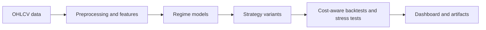
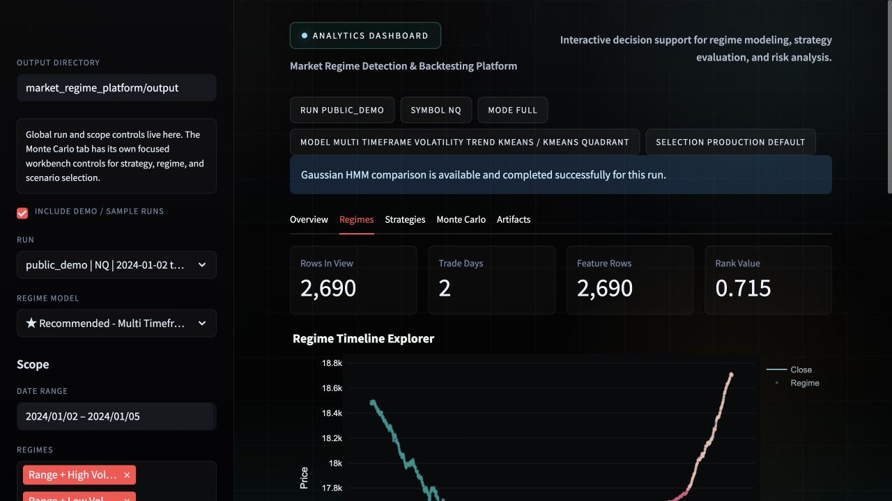

# Market Regime Detection & Backtesting Platform

## Project Overview

An end-to-end Python analytics platform for identifying changing intraday market regimes, evaluating strategy behavior across different conditions, and exploring the results through an interactive Streamlit dashboard.

The platform turns minute-level OHLCV data into interpretable trend/range and volatility regimes, compares K-Means and optional Gaussian HMM models, and evaluates 21 strategy variants with next-bar execution, transaction costs, regime-level metrics, and Monte Carlo stress tests. It supports research decisions such as which model is most robust, where a strategy performs best or fails, and how results change under different market and risk scenarios.

## Dashboard Preview


*Overview, comparison controls, and principal analytics generated from the deterministic public demo.*

## Key Capabilities

- Builds a multi-timeframe feature pipeline from minute OHLCV data.
- Maps model clusters to four interpretable regimes: trend/range crossed with low/high volatility.
- Selects K-Means candidates using robustness, separation, persistence, and interpretability diagnostics.
- Supports optional Gaussian HMM comparison and walk-forward out-of-sample validation.
- Evaluates seven strategy families as baseline, regime-aware, and liquidity-filtered variants.
- Runs no-lookahead vectorized backtests with next-bar execution and configurable transaction costs.
- Reports trade, expectancy, Sharpe, Sortino, drawdown, VaR/CVaR, and per-regime metrics.
- Stress-tests return streams with GBM, regime-mixture, and block-bootstrap Monte Carlo scenarios.
- Writes portable artifacts for an interactive Streamlit analysis and decision-support workflow.

## How It Works / Architecture



The pipeline separates data preparation, regime modeling, strategy generation, execution, evaluation, and presentation. A run produces a self-contained artifact bundle that the dashboard can load without rerunning the research pipeline.

## Market Regime Modeling

The feature pipeline combines returns, realized volatility, trend strength, price-range structure, and volume/liquidity context across short and longer windows. Candidate K-Means configurations are scored for cluster separation, label stability, persistence, balance, and economic interpretability before the highest-ranked model is selected.

Clusters are mapped to four human-readable market states rather than exposed as arbitrary numeric labels. The development workflow can also compare Gaussian HMM candidates and evaluate model selection through walk-forward, out-of-sample blocks.



*Regime visualization and model diagnostics generated from the deterministic public demo.*

## Strategy Evaluation and Backtesting

Seven strategy families are included: moving-average crossover, Donchian breakout, RSI mean reversion, z-score mean reversion, random forest, logistic regression, and gradient boosting. Each is evaluated as a baseline, regime-aware, and liquidity-filtered variant for 21 comparable strategy configurations.

Signals are shifted to the next bar before returns are calculated, preventing same-bar lookahead. Turnover-based transaction costs are deducted from every strategy, while trade logs and performance metrics are calculated both overall and by regime. Optional walk-forward artifacts preserve train/test boundaries for out-of-sample model and strategy review.

## Example Demo Outputs

Running the bundled workflow writes `market_regime_platform/output/public_demo/` with inspectable CSV and JSON artifacts, including:

- regime labels, features, transitions, stability, diagnostics, and model metadata;
- strategy signals, returns, equity curves, trades, and overall/per-regime metrics;
- Monte Carlo paths and stress summaries;
- a manifest that records data scope, parameters, costs, selected models, and generated files.

The README does not present synthetic return statistics as investment results. The bundled run exists to demonstrate the complete analytics workflow and dashboard behavior.

## Tech Stack

| Area | Tools |
| --- | --- |
| Data and time series | Python, pandas, NumPy |
| Machine learning | scikit-learn K-Means, random forest, logistic regression, gradient boosting; optional `hmmlearn` Gaussian HMM |
| Backtesting and risk | Vectorized next-bar execution, transaction costs, VaR/CVaR, Monte Carlo simulation |
| Application | Streamlit, Plotly |
| Quality | pytest |

Python 3.10+ is required; Python 3.11 or newer is recommended.

## Quickstart

From the repository root:

```bash
python -m venv .venv
source .venv/bin/activate
pip install -r requirements.txt

python run_demo.py
streamlit run market_regime_platform/app.py
```

The deterministic demo writes to `market_regime_platform/output/public_demo/`, which the dashboard discovers automatically.

To run the pipeline directly with your own intraday ES or NQ CSV:

```bash
python -m market_regime_platform.pipeline \
  --symbol NQ \
  --data-path /path/to/your/raw_1m_futures.csv \
  --run-id my_research_run
```

Expected raw columns are `ts_event`, `open`, `high`, `low`, `close`, `volume`, and `symbol`.

## Testing

```bash
python -m pytest
```

The 19-test suite covers data loading, regime labeling, strategy variants, next-bar execution, stress outputs, dashboard artifact loading, and Streamlit smoke rendering.

## Demo Data and Provenance

> The public demo uses deterministic synthetic futures-style OHLCV data so the repository is reproducible and safe to distribute. It demonstrates the same intraday processing, modeling, and evaluation pipeline without including the original research data or licensed market data.

The bundled dataset can be regenerated with `python scripts/generate_synthetic_demo_data.py`. The seed and generation process are kept in source control so the demo is reproducible.

## Limitations and Disclaimer

This is a research and portfolio demonstration, not an execution system or investment product. Results are sensitive to feature windows, modeling choices, transaction-cost assumptions, market microstructure, and dataset scope. Nothing in this repository is investment advice.
