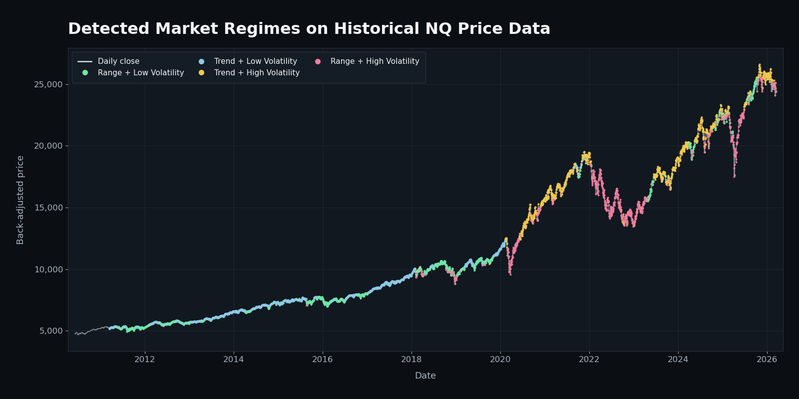
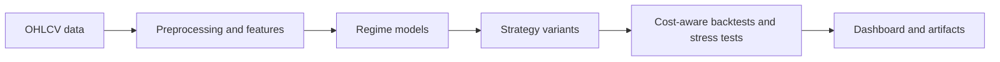
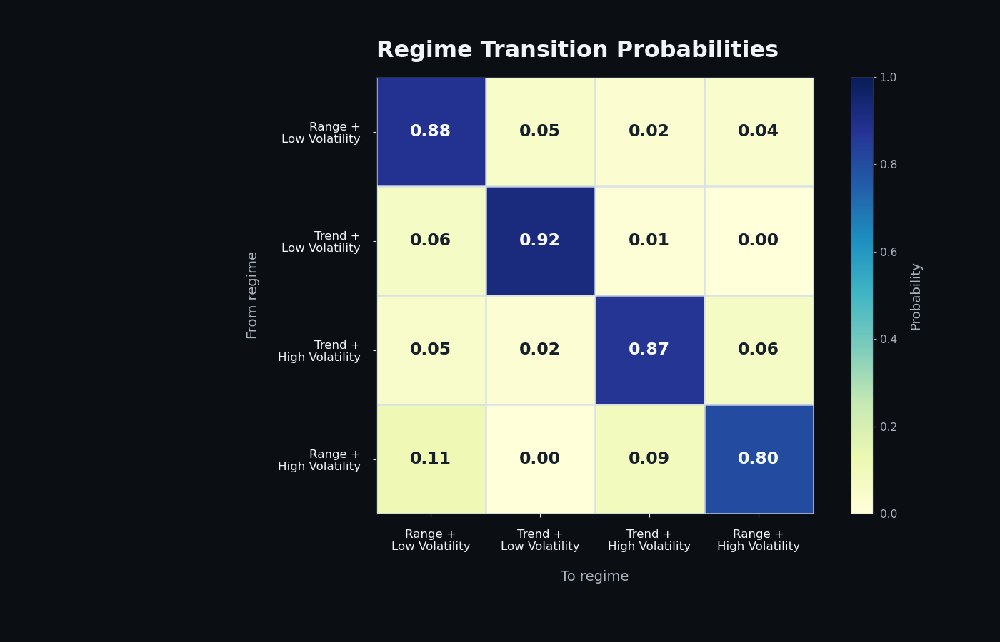
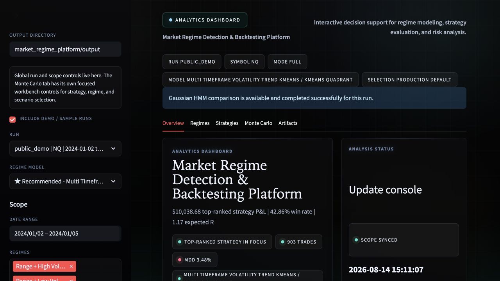

# Market Regime Detection & Backtesting Platform

I built this project to explore a question I kept running into while testing trading strategies: **how much does a strategy's performance depend on the type of market it is trading in?**

Instead of treating every market environment the same, the platform classifies intraday price data into different regimes, tests strategies across those conditions, and makes the results easier to explore through a Streamlit dashboard.

The project combines **time-series feature engineering, K-Means and HMM-based regime modeling, strategy backtesting, risk analysis, and interactive visualization** in one Python workflow.

## Regime detection example



*Detected regimes overlaid on the project's historical NQ dataset.*

This is a derived visualization from the original research dataset; the raw historical data is not included, and the runnable public demo remains deterministic and synthetic.

## What it does

Starting with minute-level OHLCV data, the platform:

- builds features across multiple timeframes;
- maps market behavior into four trend/range and volatility regimes;
- compares K-Means configurations and optionally Gaussian HMM models;
- evaluates seven strategy families across baseline, regime-aware, and liquidity-filtered versions;
- uses next-bar execution and configurable transaction costs in backtests;
- calculates performance and risk metrics overall and by regime;
- runs Monte Carlo stress tests using several simulation methods;
- saves the results so they can be explored in the Streamlit dashboard.

In total, the framework evaluates **21 strategy configurations**.

## How it works



I kept the main parts of the workflow separate so the feature pipeline, regime models, strategies, backtests, and dashboard can be changed or evaluated independently.

A completed run generates the files needed by the dashboard, so the results can be reopened without rerunning the full research pipeline.

## Market regime modeling

The feature pipeline uses returns, realized volatility, trend strength, price-range behavior, and volume/liquidity information across short and longer timeframes.

K-Means candidates are compared using measures such as cluster separation, stability, persistence, balance, and how clearly the resulting clusters map to recognizable market behavior.

The selected clusters are then translated into four easier-to-understand market states based on:

- trend vs. range behavior;
- lower vs. higher volatility.

The project also supports Gaussian HMM comparison and walk-forward out-of-sample evaluation.



*Transition probabilities between the four detected market regimes.*

## Strategy evaluation and backtesting

The project includes seven strategy families:

- Moving Average Crossover
- Donchian Breakout
- RSI Mean Reversion
- Z-Score Mean Reversion
- Random Forest
- Logistic Regression
- Gradient Boosting

Each strategy is tested in three versions:

1. baseline;
2. regime-aware;
3. liquidity-filtered.

This produces **21 comparable strategy configurations**.

Signals are shifted to the next bar before returns are calculated to avoid same-bar lookahead. Transaction costs are deducted based on turnover, and performance is measured both overall and within individual market regimes.

The framework also supports walk-forward outputs that preserve train/test boundaries for out-of-sample review.

## Performance and risk analysis

The backtesting layer calculates metrics including:

- trade-level results;
- expectancy;
- Sharpe and Sortino ratios;
- drawdown;
- VaR and CVaR;
- equity curves;
- performance by market regime.

I also included Monte Carlo stress testing because I wanted to look beyond a single historical equity curve and see how results might change under different return sequences and market environments.

Supported simulation approaches include:

- Geometric Brownian Motion;
- regime-mixture simulation;
- block-bootstrap simulation.

## Dashboard

The Streamlit dashboard provides an interactive interface for comparing models, strategies, regimes, and generated artifacts from a completed run.



*Dashboard overview generated from the deterministic public demo.*

## Demo outputs

Running the bundled workflow writes results to:

`market_regime_platform/output/public_demo/`

The output includes:

- regime labels, features, transitions, stability diagnostics, and model metadata;
- strategy signals, returns, equity curves, trades, and performance metrics;
- Monte Carlo paths and stress-test summaries;
- a run manifest containing the data scope, parameters, transaction-cost assumptions, selected models, and generated files.

The bundled run is meant to demonstrate how the full pipeline and dashboard work. Any performance shown in the public demo comes from synthetic data and should not be interpreted as real trading results.

## Tech stack

| Area | Tools |
| --- | --- |
| Data and time series | Python, pandas, NumPy |
| Machine learning | scikit-learn, K-Means, Random Forest, Logistic Regression, Gradient Boosting, optional `hmmlearn` Gaussian HMM |
| Backtesting and risk | Vectorized next-bar execution, transaction costs, VaR/CVaR, Monte Carlo simulation |
| Dashboard | Streamlit, Plotly |
| Testing | pytest |

Python 3.10+ is required. Python 3.11 or newer is recommended.

## Running it locally

From the repository root:

```bash
python -m venv .venv
source .venv/bin/activate
pip install -r requirements.txt

python run_demo.py
streamlit run market_regime_platform/app.py
```

The demo writes its output to:

```text
market_regime_platform/output/public_demo/
```

The dashboard discovers this run automatically.

You can also run the pipeline using your own intraday ES or NQ CSV:

```bash
python -m market_regime_platform.pipeline \
  --symbol NQ \
  --data-path /path/to/your/raw_1m_futures.csv \
  --run-id my_research_run
```

Expected columns are:

`ts_event`, `open`, `high`, `low`, `close`, `volume`, and `symbol`.

## Testing

Run the test suite with:

```bash
python -m pytest
```

The current suite contains **19 tests** covering:

- data loading;
- regime labeling;
- strategy variants;
- next-bar execution;
- stress-test outputs;
- dashboard artifact loading;
- Streamlit smoke rendering.

## Public demo data

The public version uses a deterministic synthetic futures-style OHLCV dataset so the project can be run without distributing the original project data.

The synthetic dataset goes through the same feature engineering, regime modeling, strategy evaluation, backtesting, and dashboard workflow as the original dataset.

The historical figures in this README are derived outputs only; the bundled runnable dataset remains synthetic.

It can be regenerated with:

```bash
python scripts/generate_synthetic_demo_data.py
```

The generation process and random seed are kept in the repository so the demo is reproducible.

## Notes

This project is meant for research and portfolio demonstration.

Backtest results depend heavily on the dataset, feature definitions, model settings, transaction-cost assumptions, and market period being tested.

It is not a live execution system, trading product, or investment advice.
