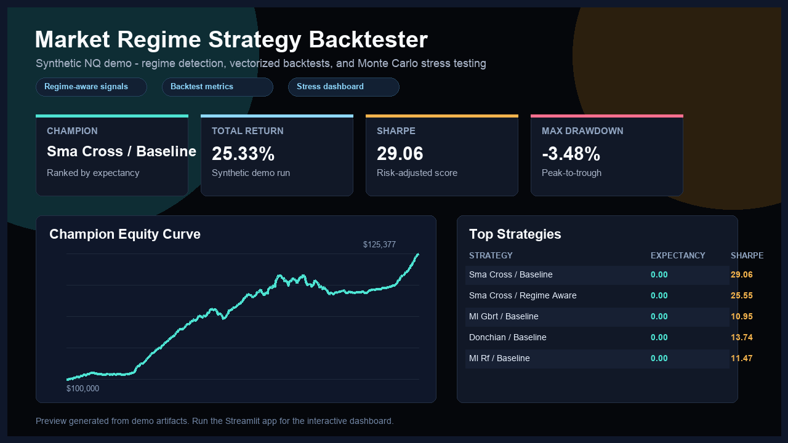

# Market Regime Strategy Backtester

An end-to-end quantitative research project that detects intraday market regimes, adapts trading signals to those regimes, backtests the strategies, stress-tests the return streams, and presents the results in a Streamlit dashboard.



## One-Minute Overview

- **Problem:** intraday strategies often behave differently in trend/range and high/low volatility environments.
- **Solution:** classify market regimes from minute OHLCV features, run regime-aware strategy variants, and compare performance/risk by regime.
- **What is included:** data cleaning, regime detection, signal generation, vectorized backtesting, Monte Carlo stress testing, dashboard artifact loading, and tests.
- **Public-safe demo:** the bundled NQ-style CSV is deterministic synthetic data generated by `scripts/generate_synthetic_demo_data.py`.
- **Tech stack:** Python, pandas, NumPy, scikit-learn, hmmlearn, Plotly, Streamlit, pytest.

## Quick Start

```bash
python -m venv .venv
source .venv/bin/activate
pip install -r requirements.txt

python run_demo.py
streamlit run regime_strategy_backtester/app.py
```

The demo writes artifacts to `regime_strategy_backtester/output/demo_submission/`. The dashboard opens that generated run by default, so recruiters and reviewers can reproduce the workflow without external data.

## What The Pipeline Does

1. **Loads futures-style minute data** from the bundled synthetic NQ sample or from a user-provided raw CSV.
2. **Builds regime features** across intraday and higher-timeframe windows.
3. **Labels regimes** such as trend/range and high/low volatility, with optional HMM comparison when `hmmlearn` is installed.
4. **Generates strategy variants** including baseline, regime-aware, liquidity-filtered, and model-based signals.
5. **Runs vectorized backtests** with next-bar execution, transaction costs, per-regime metrics, and trade logs.
6. **Stress-tests outcomes** with Monte Carlo paths and drawdown/risk summaries.
7. **Renders a dashboard** for strategy ranking, regime diagnostics, equity curves, trades, and stress scenarios.

## Repository Layout

```text
regime_strategy_backtester/
  app.py                         # Streamlit dashboard
  pipeline.py                    # CLI pipeline and artifact writer
  backtesting/                   # Vectorized execution and metrics
  data/                          # Loader plus synthetic demo CSV
  regimes/                       # Regime detection and validation
  strategies/                    # Strategy signal registry
  stress/                        # Monte Carlo stress suite
  viz/                           # Dashboard artifact loading
scripts/
  generate_synthetic_demo_data.py
run_demo.py
requirements.txt
```

## Use Your Own Data

The public repo includes synthetic demo data only. To run on your own ES or NQ minute CSV:

```bash
python -m regime_strategy_backtester.pipeline \
  --symbol NQ \
  --data-path /path/to/your/raw_1m_futures.csv \
  --run-id my_research_run
```

Expected raw columns are `ts_event`, `open`, `high`, `low`, `close`, `volume`, and `symbol`.

## Tests

```bash
python -m pytest
```

The test suite covers data loading, regime labels, strategy variants, next-bar execution, stress outputs, dashboard loading, and Streamlit smoke rendering.

## Notes

This project is for research and portfolio demonstration only. It is not investment advice, and the bundled dataset is synthetic rather than live or licensed market data.
